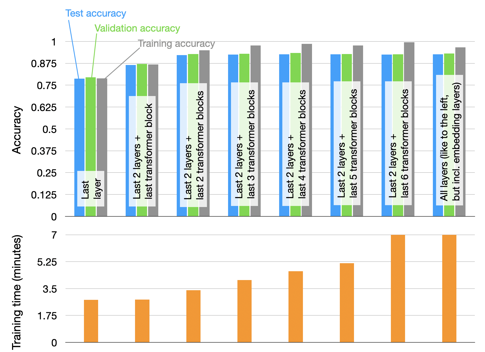

# Layerwise experiment

Run

```bash
python layerwise-experiment-run.py
```

to produce the `layerwise-experiment-results-clean.txt` files. The first `Test metric` in each section represents the training accuracy, the second instance the validation accuracy, and the third instance the test accuracy.  The `results.txt` file is a more readable, annotated version. 

The results are visualized below (plotting code note included.)

