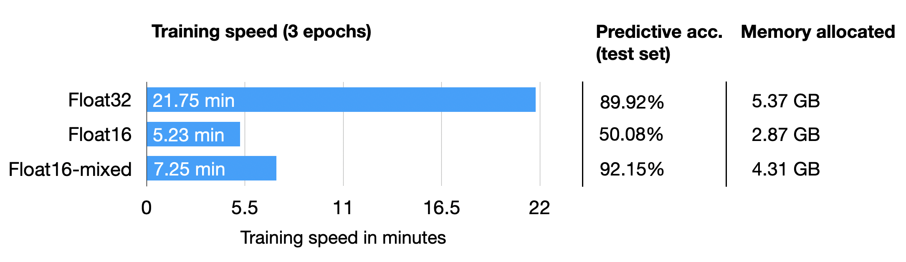
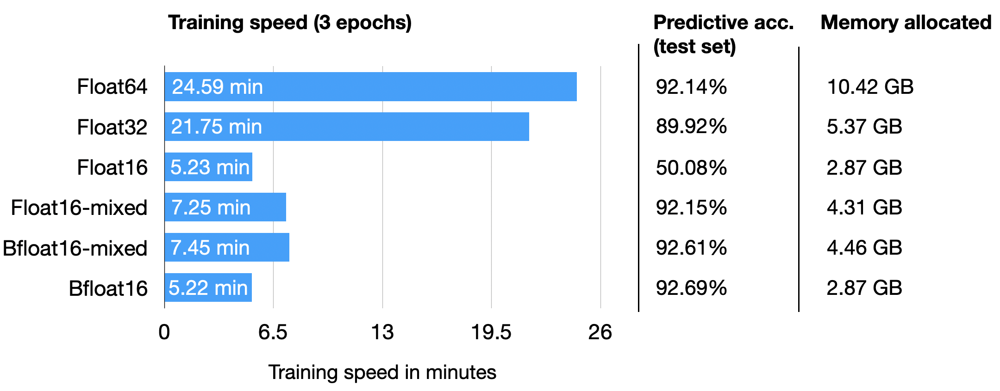
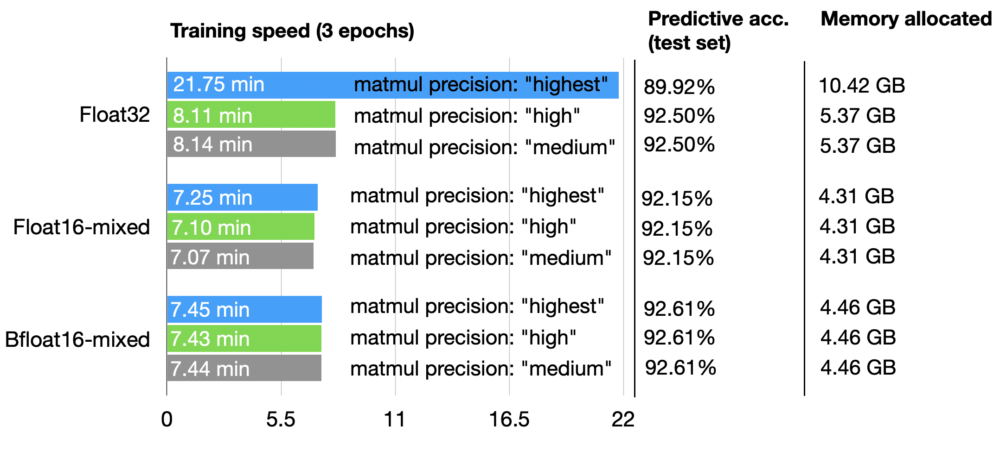

All results from training on a single A100 GPU.


# Summary








---

# Raw results


# torch.set_float32_matmul_precision("highest")


## Float16-mixed

```python
python float16-mixed.py
```

```
Python implementation: CPython
Python version       : 3.9.16

torch       : 2.0.0
lightning   : 2.0.2
transformers: 4.28.1
Torch CUDA available? True
...
Epoch: 0002/0003 | Train acc.: 95.19% | Val acc.: 92.55%
Epoch: 0003/0003 | Batch 0000/2916 | Loss: 0.0083
Epoch: 0003/0003 | Batch 0300/2916 | Loss: 0.1804
Epoch: 0003/0003 | Batch 0600/2916 | Loss: 0.0056
Epoch: 0003/0003 | Batch 0900/2916 | Loss: 0.0197
Epoch: 0003/0003 | Batch 1200/2916 | Loss: 0.0146
Epoch: 0003/0003 | Batch 1500/2916 | Loss: 0.0085
Epoch: 0003/0003 | Batch 1800/2916 | Loss: 0.0166
Epoch: 0003/0003 | Batch 2100/2916 | Loss: 0.0034
Epoch: 0003/0003 | Batch 2400/2916 | Loss: 0.0271
Epoch: 0003/0003 | Batch 2700/2916 | Loss: 0.0537
Epoch: 0003/0003 | Train acc.: 97.39% | Val acc.: 92.21%
Time elapsed 7.25 min
Memory used: 4.31 GB
Test accuracy 92.15%
```

## Bfloat16-mixed

```python
python bfloat16-mixed.py
```

```
Python implementation: CPython
Python version       : 3.9.16

torch       : 2.0.0
lightning   : 2.0.2
transformers: 4.28.1

Torch CUDA available? True
GPU supports bfloat16: True
...
Time elapsed 7.45 min
Memory used: 4.46 GB
Test accuracy 92.61%
```

## Float16-regular

```
Epoch: 0003/0003 | Batch 2700/2916 | Loss: nan
Epoch: 0003/0003 | Train acc.: 49.86% | Val acc.: 50.80%
Time elapsed 5.23 min
Memory used: 2.87 GB
Test accuracy 50.08%
```

## Bfloat16-regular

```
Train acc.: 96.55% | Val acc.: 92.59%
Time elapsed 5.22 min
Memory used: 2.87 GB
Test accuracy 92.69%
```

## Float32-regular

```
Epoch: 0003/0003 | Train acc.: 97.28% | Val acc.: 89.88%
Time elapsed 21.75 min
Memory used: 5.37 GB
Test accuracy 89.92%
```

## Float64-regular

```
Time elapsed 24.59 min
Memory used: 10.42 GB
Test accuracy 92.14%
```

---

# torch.set_float32_matmul_precision("high")

## float-32

```
Epoch: 0003/0003 | Train acc.: 97.41% | Val acc.: 92.75%
Time elapsed 8.11 min
Memory used: 5.37 GB
Test accuracy 92.50%
```

## float-16 mixed

```
...
Time elapsed 7.10 min
Memory used: 4.31 GB
Test accuracy 92.15%
```

## bfloat-16 mixed


```
Time elapsed 7.43 min
Memory used: 4.46 GB
Test accuracy 92.61%
```

---

# torch.set_float32_matmul_precision("medium")

## float-32

```
...
Epoch: 0003/0003 | Train acc.: 97.41% | Val acc.: 92.75%
Time elapsed 8.14 min
Memory used: 5.37 GB
Test accuracy 92.50%
```

## float-16 mixed

```
...
Time elapsed 7.07 min
Memory used: 4.31 GB
Test accuracy 92.15%

```

## bfloat-16 mixed

```
...
Epoch: 0003/0003 | Train acc.: 97.41% | Val acc.: 92.97%
Time elapsed 7.44 min
Memory used: 4.46 GB
Test accuracy 92.61%
```