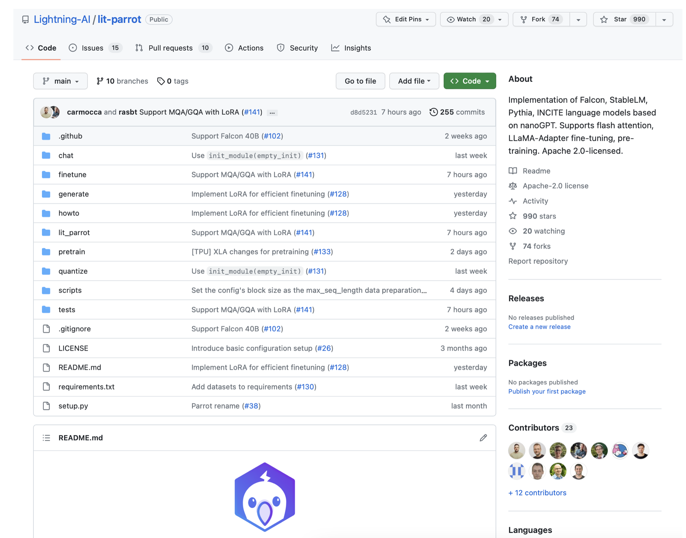
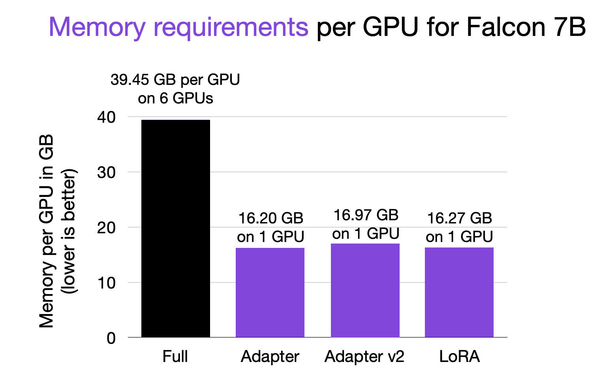

# Hyperparameter settings for finetuning Falcon 7B


These need to be used in combination with the https://github.com/Lightning-AI/lit-parrot repository.


**Preparing the model and dataset**

For this benchmark, we will be using the [Lit-Parrot](https://github.com/Lightning-AI/lit-parrot) open-source library, which provides efficient implementations for training and using various LLMs.



Title: The Lit-Parrot repository (https://github.com/Lightning-AI/lit-parrot)


The first  step is to download the model:

```
python scripts/download.py --repo_id tiiuae/falcon-7b
```

(This requires approximately 20 Gb of storage.)


Second, we convert the weights into a standardized form:

```
python scripts/convert_hf_checkpoint.py --checkpoint_dir checkpoints/tiiuae/falcon-7b
```

Third, we have to download the dataset. For this example, we will be using the Alpaca dataset [link] consisting of 52 instruction pairs: 

```
python scripts/prepare_alpaca.py
```

(More on using custom datasets later.)

**Running the code**

Now, we are running the finetuning scripts for the Falcon 7B model. We are going to compare 4 different methods below.  For now, we are going to focus on the finetuning results. And we will discuss how these methods work later in this article.

Adapter: 

```python finetune/adapter.py --checkpoint_dir checkpoints/tiiuae/falcon-7b/
python finetune/adapter.py  --checkpoint_dir checkpoints/tiiuae/falcon-7b/
```

Adapter v2: 

```
python finetune/adapter_v2.py  --checkpoint_dir checkpoints/tiiuae/falcon-7b/
```

LoRA: 

```
python finetune/lora.py  --checkpoint_dir checkpoints/tiiuae/falcon-7b/
```

Full finetuning (updating all layers):

```
python finetune/lora.py  --checkpoint_dir checkpoints/tiiuae/falcon-7b/
```

Let's take a look at the time it takes to finetune the LLM first:


As we can see in the chart above, using a parameter-efficient finetuning method is about 9 times faster than finetuning all layers ("full"). Moreover, finetuning all layers required 6 GPUs due to memory constraints, whereas **the Adapter methods and LoRA could be used on a single GPU**.

So, speaking of GPU memory requirements, the peak memory requirements are plotted below:




Finetuning all layers of Falcon 7B required ~40 GB on each of the 6 GPUs (here, via tensor sharding using DeepSpeed). So, that's 240 Gb in total. In contrast, the parameter-efficient finetuning methods only required ~16 GB RAM, which allows users to even finetune these models on a single consumer-grade GPU.

By the way, note that the memory requirements are directly related to the number of parameters that are required to be updated for each method:

- Full finetuning: 7,217,189,760
- Adapter: 1,365,330
- Adapter v2: 3,839,186
- LoRA: 3,506,176
